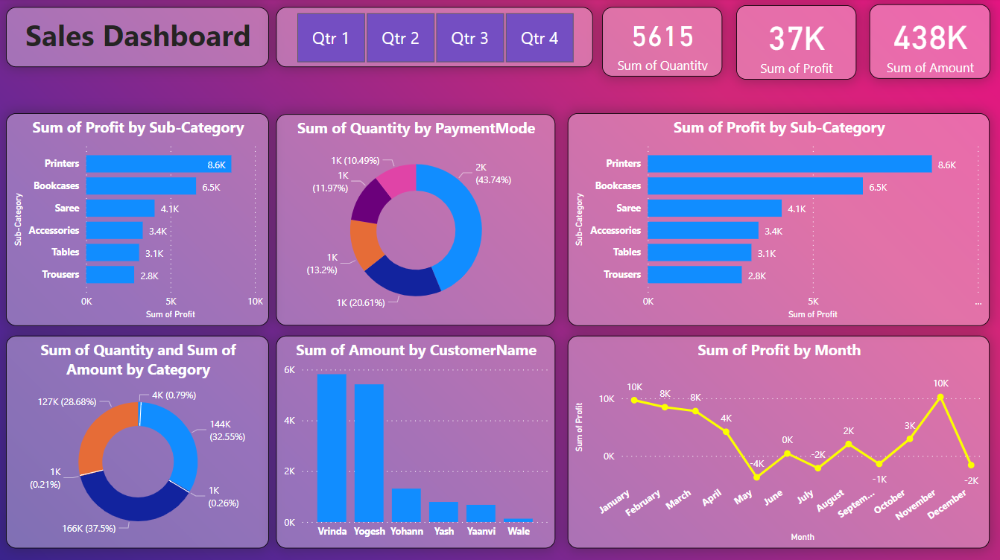

# PowerBI Sales Dashboard

## Overview
This repository contains a professional Power BI sales dashboard project designed to visualize and analyze sales data efficiently. The dashboard provides actionable insights for business decision-making and performance tracking.

## Repository Structure
```
PowerBI-Sales-Dashboard/
│
├── SalesReportDemo-By-RashminGajera.pbix   # Power BI report file
├── sales_report.png                        # Demo screenshot of the dashboard
├── Background Image.png                    # Custom background image for the report
├── README.md                               # Project documentation
└── datasource/                             # Source data for the dashboard
	├── Orders.csv                          # Orders data
	└── Details.csv                         # Additional details data
```

### Data Source Folder
- **Orders.csv**: Contains raw order data including order IDs, dates, customer information, and sales figures.
- **Details.csv**: Provides supplementary details related to orders, such as product information and categories.

### Power BI Report
- **SalesReportDemo-By-RashminGajera.pbix**: The main Power BI report file. Open this file in Power BI Desktop to view and interact with the dashboard.

## Dashboard Demo
Below is a preview of the sales dashboard:



## Getting Started
1. Clone this repository to your local machine.
2. Open `SalesReportDemo-By-RashminGajera.pbix` in Power BI Desktop.
3. Review and explore the dashboard using the provided data in the `datasource` folder.

## Author
**Rashmin Gajera**

---
For any questions or feedback, please contact the repository owner.
# PowerBI-Sales-Dashboard